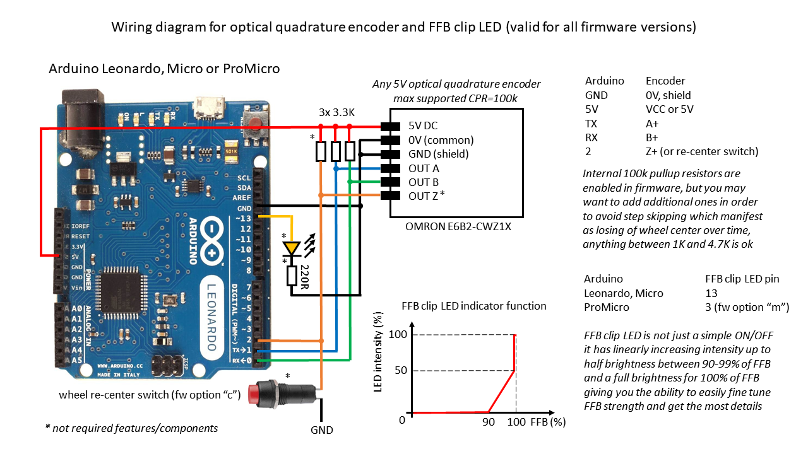
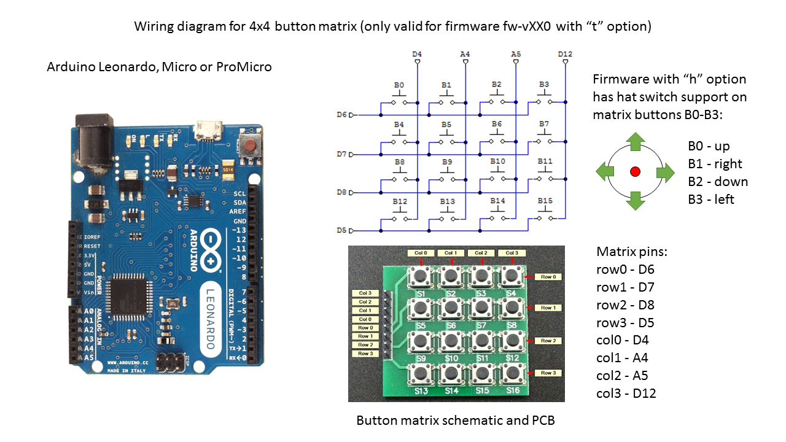
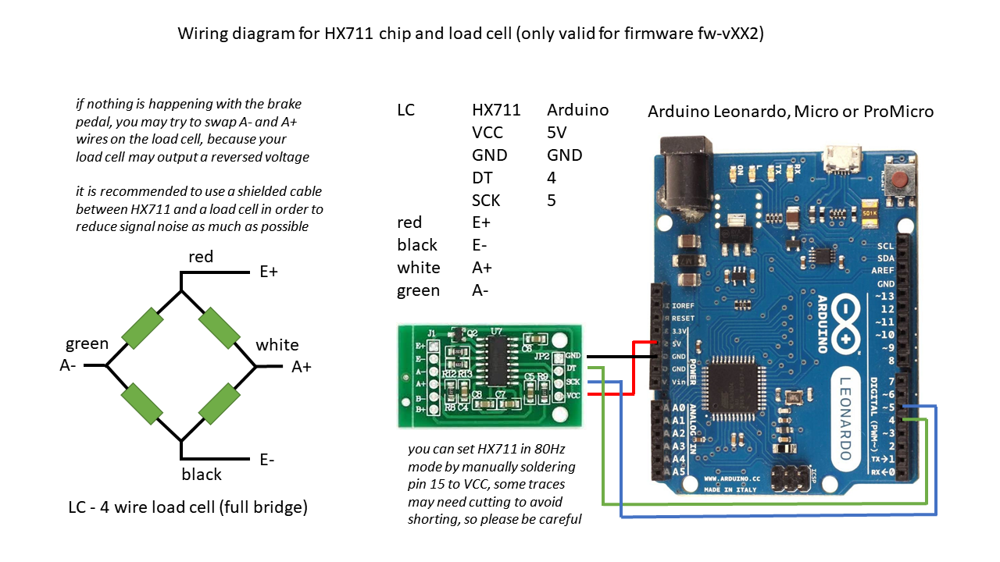
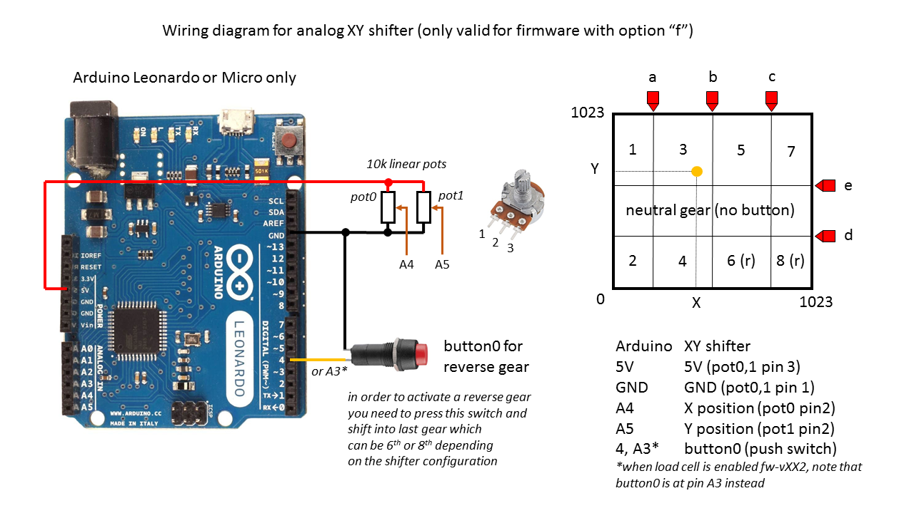

# Arduino-FFB-wheel
Stand alone directInput USB device recognized in Windows as a joystick with force feedback functionality, based on BRWheel by Fernando Igor from 2017.

Firmware features:
- supported Arduino boards: Leonardo, Micro and ProMicro (ATmega32U4, 5V, 16MHz)
- 4 analog axis + 1 for optical encoder, 2 FFB axis (only 1 has pwm or dac output)
- automatic or manual analog axis calibration
- up to 16 buttons by 4x4 matrix or via **[button box firmware](https://github.com/ranenbg/Arduino-FFB-wheel/tree/master/tx_rw_ferrari_458_wheel_emu_16buttons)** uploaded to Arduino Nano/Uno
- analog XY H-pattern shifter, configurable to 6/8 gears + reverse
- fully supported 16bit FFB effects (custom force effect not implemented)
- envelope and conditional block effects, start delay, durration, deadband, direction enable
- FFB calculation and axis/button update rate is 500Hz (2ms period)
- many firmware options (external 12bit ADC/DAC, automatic/manual pedal calibration, z-index support/offset/reset, hatswitch, button matrix, external shift register, hardware wheel re-center, xy analog H shifter)
- RS232 serial interface for configuration of all wheel parameters
- fully adjustable FFB output in the form of 2 channel digital 16bit PWM or analog 12bit DAC signals
- available pwm modes: pwm+-, pwm+dir, pwm0.50.100, rcm
- available dac modes: dac+-, dac+dir
- load cell support for HX711 chip (for brake pedal axis only)
- all wheel parameters are stored in EEPROM (and automatically loaded at each powerup)
- original wheel control user interface **[Arduino FFB gui](https://github.com/ranenbg/Arduino-FFB-gui)** for an easy configuration and monitoring of all inputs/outputs 

Detailed documentation and more information about the firmware can be found in txt files inside **[docs](https://github.com/ranenbg/Arduino-FFB-wheel/tree/master/brWheel_my/docs)** folder. Compiled firmware in HEX format for Arduino Leonardo and Micro can be found in **[leonardo hex](https://github.com/ranenbg/Arduino-FFB-wheel/tree/master/brWheel_my/leonardo%20hex)**, while firmware for Arduino ProMicro (with replacement pinout) is located in **[micro hex](https://github.com/ranenbg/Arduino-FFB-wheel/tree/master/brWheel_my/micro%20hex)** folder. All neccessary wiring diagrams are in **[wirings](https://github.com/ranenbg/Arduino-FFB-wheel/tree/master/brWheel_my/wirings)** folder.

# Firmware pinouts and wiring diagrams

## Encoder and LED wiring

## Motor driver wiring

## Button box firmware pinouts - for Arduino Nano/Uno

## Button matrix pinouts

## External i2C device pinouts

## HX711 and load cell wiring

## XY shifter wiring

## Firmware option description
Due to 32k flash memory limitation in Arduino Leonardo (ATmega32U4), each HEX file is compiled with a certain firmware option. A one letter abreviation for each option is placed in the firmware version string and one needs to consider carefully which one to chose. In the release, I've compiled for you a few most often used firmware option combinations.

Firmware version string consists out of 3 digits and some letters (example: fw-v210ahz). The first two digits (XX) are reserved for major firmware version, while the 3rd digit (0,1,2,3) stands for:
- fw-vXX0 basic version (1 optical encoder, 4 analog axis, 8 buttons, 2ch PWM output)
- fw-vXX1 adds support for shift register 
- fw-vXX2 adds support for shift register+HX711
- fw-vXX3 adds support for shift register+HX711+MCP4725 analog DAC's

 Here is the complete list of all available options that may be added to any of the above firmware*:
- "a" pedal axis autocalibration enabled (otherwise a manual calibration is enabled)
- "z" Z-index encoder support
- "c" hardware wheel re-center enabled
- "h" Hat Switch support
- "s" external ADC support for pedals with ADS1015
- "i" averaging of analog inputs
- "t" 4x4 button matrix support
- "f" analog XY shifter support
- "e" two extra digital buttons enabled instead of analog clutch and handbrake axis
- "m" replacement pinouts for Arduino ProMicro

note* some combinations are not possible at the same time, like "fw-vXXXzs", or "fw-v213z" beacause they would use the same hardware interrupt pin for more than 1 function, while some are not possible due to ATmega32U4 32k memory limit

## Firmware download

+ ***[Latest Release](https://github.com/ranenbg/Arduino-FFB-wheel/releases/latest)***
+ ***[Past Versions](https://github.com/ranenbg/Arduino-FFB-wheel/releases)***

## Firmware upload procedure
You can use **[XLoader](https://github.com/ranenbg/Arduino-FFB-wheel/tree/master/XLoader)**:
- set 57600baud, ATmega32U4 microcontroler and select desired HEX
- press reset button on Arduino (or shortly connect RST pin to GND)
- select newly appeared COM port (Arduino in bootloader mode*) and press upload, you will only have a few seconds

*It is possible that some cheap chinese clones of Arduino Leonardo, Micro or ProMicro do not have a bootloader programmed. In that case you need to upload the original Arduino Leonardo bootloader first. You can find more details about it here: https://docs.arduino.cc/built-in-examples/arduino-isp/ArduinoISP

## Credits

Original BRWheel firmware by: Tero Loimuneva, Saku Kekkonen, Etienne Saint-Paul and Fernando Igor.
https://github.com/fernandoigor/BRWheel/tree/alphatest
