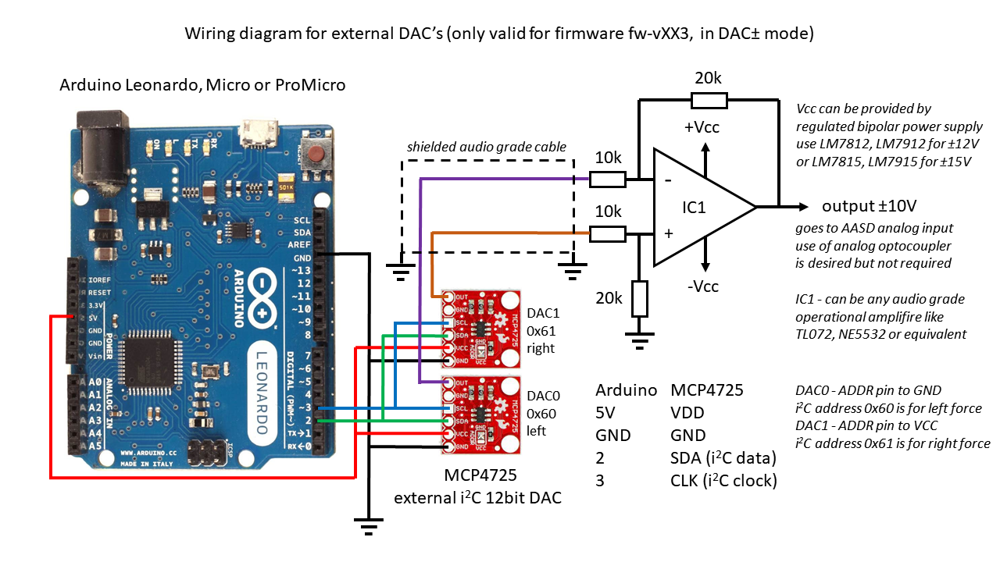

# Arduino-FFB-wheel
Stand alone USB device recognized as a joystick with force feedback functionality, based on BRWheel by Fernando Igor from 2017.

Firmware features:
- supported Arduino boards: Leonardo, Micro and ProMicro (5V, 16MHz)
- 4 analog axis + 1 for optical encoder, 2 FFB axis (only 1 has pwm or dac output)
- 16 buttons via button box firmware uploaded to Arduino Nano/Uno
- fully supported 16bit FFB effects (custom force effect not implemented)
- envelope and conditional block effects, start delay, durration, deadband
- FFB calculation and axis/button update rate is 500Hz (2ms period)
- many options available (external 12bit ADC/DAC, pedal autocalibration, z-index, hatswitch)
- RS232 serial interface for configuration of all wheel parameters
- fully adjustable FFB output in the form of 2channel digital PWM or analog DAC signals
- load cell support for HX711 chip (for brake pedal axis only)
- all wheel parameters are stored in EEPROM (and automatically loaded at each powerup)
- wheel control user interface for an easy configuration and monitoring of all inputs/outputs

Detailed documentation and more information about the firmware can be found in txt files inside brWheel_my folder.

# Firmware pinouts and wiring diagrams

Button box firmware pinouts - for Arduino Nano/Uno

## Firmware download

+ ***[Latest Release](https://github.com/ranenbg/Arduino-FFB-wheel/releases/latest)***
+ ***[Past Versions](https://github.com/ranenbg/Arduino-FFB-wheel/releases)***

## Firmware upload procedure
You can use XLoader https://github.com/xinabox/xLoader:
- set 57600baud, ATMega32U4 microcontroler and select desired HEX
- press reset button on Arduino (or shortly connect RST pin to GND)
- select newly appeared COM port (Arduino in bootloader mode*) and press upload (you will only have a few seconds)

*It is possible that some cheap chinese clones of Arduino Leonardo, Micro or ProMicro do not have a bootloader programmed. In that case you need to upload the original Arduino Leonardo bootloader first. You can find more details about it here: https://docs.arduino.cc/built-in-examples/arduino-isp/ArduinoISP

## Credits

Original BRWheel firmware by: Tero Loimuneva, Saku Kekkonen, Etienne Saint-Paul and Fernando Igor.
https://github.com/fernandoigor/BRWheel/tree/alphatest
